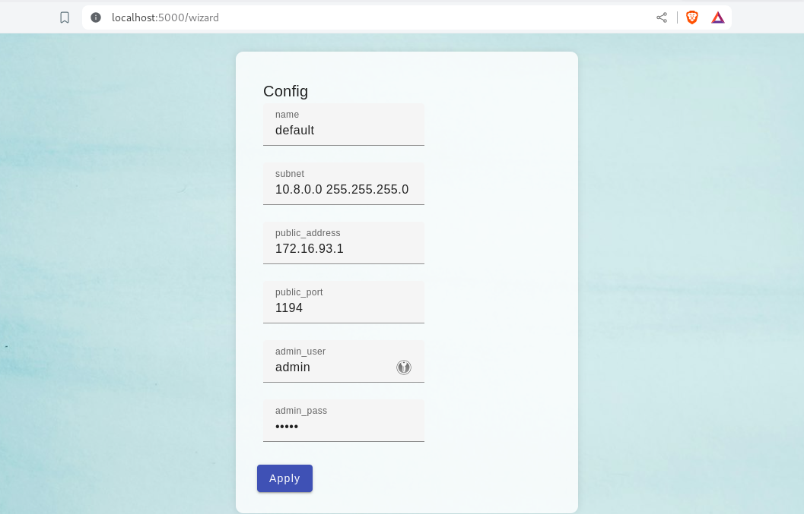
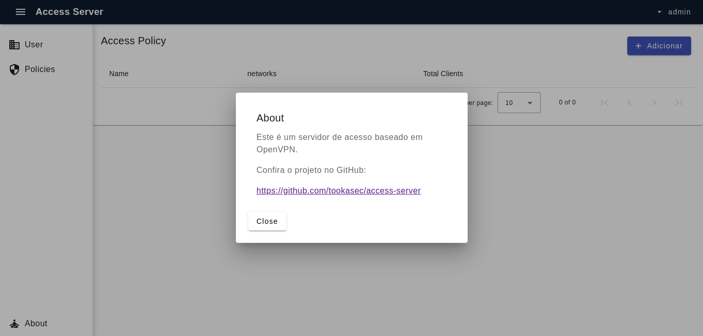

# Access Server

It's a full network tunneling VPN software solution that integrates OpenVPN server capabilities and enterprise management capabilities.

## Host Configuration
Before diving into the container setup, ensure the following configurations on your host machine:

### Enable the TUN kernel module:
The TUN module is a kernel driver that allows user-space programs to create virtual network interfaces, which can be used to transport network traffic securely between two points.

```
modprobe tun
```

### Enable Ip forward
If your container will forward requests, modify /etc/sysctl.conf:

```
echo "net.ipv4.ip_forward=1" >> /etc/sysctl.conf
sysctl -p
```

## Executing container
Container VPN service will need to know its publication IP and port to pre-build client configuration:
```
docker volume create vpn_config
docker run --privileged -p 1194:1194 -p 5000:5000 \
    -v vpn_config:/opt/access-server/data \
    --name tooka-as \
    liberatti/access-server:latest
```
## Configuration

After startup, it is possible to configure vpn service on http://localhost:5000



This may take a wile, all the pki wil be generated




## License Terms

This product utilizes OpenVPN, an open-source software application that provides a secure, point-to-point or site-to-site connection in a routed or bridged configuration. OpenVPN is developed and maintained by the OpenVPN Project.

### Overview

The GNU General Public License (GPL) is an open-source software license developed by the Free Software Foundation (FSF). It is designed to ensure the freedom to use, modify, and distribute software while preserving user rights.

### Full License Text

For the complete text of the GNU General Public License, refer to the [official GPL page](https://www.gnu.org/licenses/gpl.html).


### OpenVPN Project

- **Website:** [OpenVPN Project](https://openvpn.net/)
- **GitHub Repository:** [OpenVPN on GitHub](https://github.com/OpenVPN)